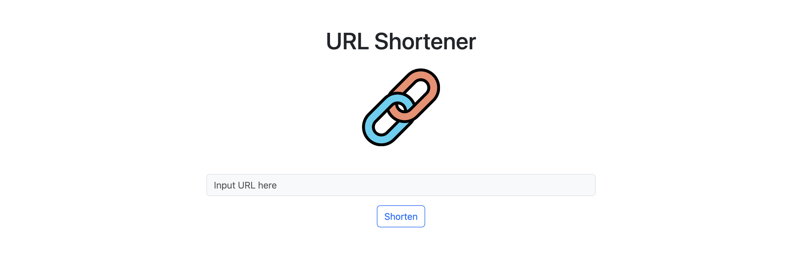

# URL Shortener 短網址產生器

## 功能
- 輸入網址轉換成短網址
- 點擊按鈕複製網址
- 透過短網址，轉址到原始網址

## 開始使用
1. 請先確認本地端有安裝 Node.js 及 npm

2. 將專案 git clone 至本地端

3. 開啟終端機移動至專案資料夾

`cd <專案資料夾位置>`

4. 安裝需要的套件

`npm install`

5. 安裝完成後，設定環境變數，連線 MongoDB

`MONGODB_URI=mongodb+srv://<Your MongoDB Account>:<Your MongoDB Password>@cluster0.xxxx.xxxx.net/<Your MongoDB Table>?retryWrites=true&w=majority`

6. 執行專案

`npm run start`

7. 若出現此訊息表示執行順利，在瀏覽器輸入以下網址開始使用

`App is running on http://localhost:3000
mongodb connected!`

8. 如果要暫停使用，請在終端機輸入以下指令，並關閉瀏覽器

`ctrl + c`

## 開發工具
- Node.js ^18.14.2
- Nodemon
- Express ^4.18.2
- Express-handlebars ^7.0.1
- MongoDB
- mongoose ^7.0.0
- dotenv ^16.0.3
- Bootstrap